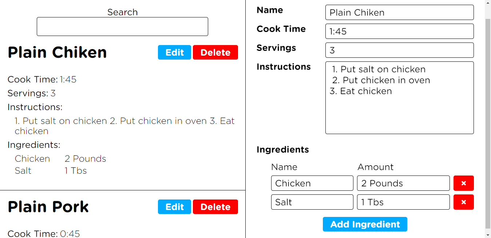

# Cozinhando com React

 

### App de receitas feito com ReactJs para aprender os principais conceitos e hooks dessa biblioteca JavaScript. 

<h1 align="center">
  
</h1>

 
Veja a live demo [aqui](https://cozinhando-com-react.netlify.app/)

### Conceitos abordados
- useEffect
- useState
- createContext
- Local Storage

### Features
- [x] Adicionar receita
- [x] Editar receita
- [x] Excluir receita
- [x] Pesquisar receita
